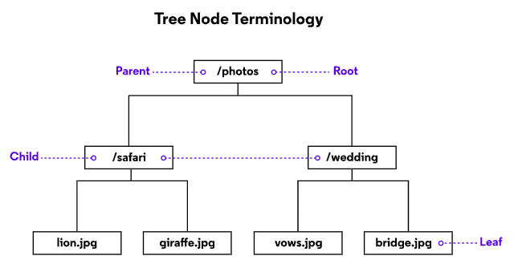
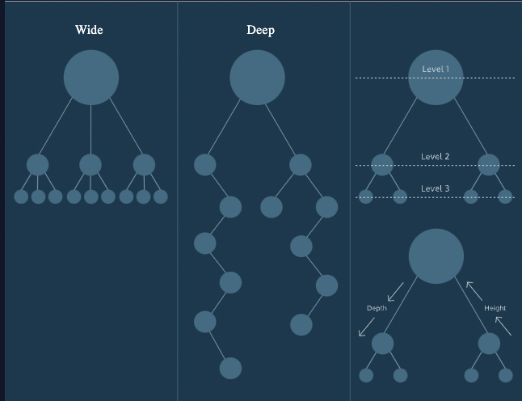
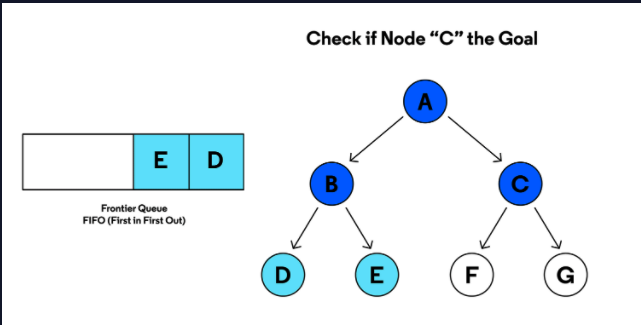
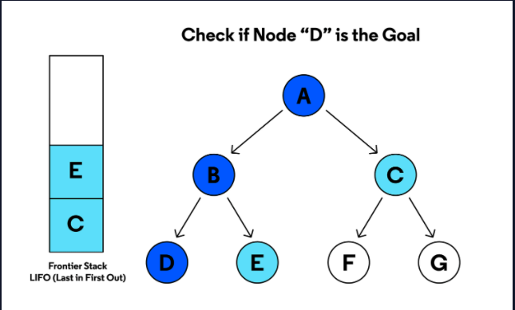
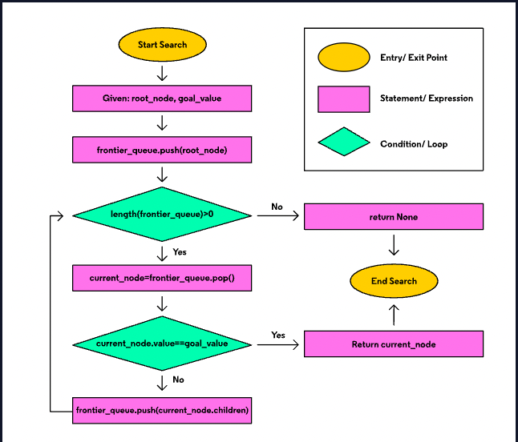

# Trees Overview 

Trees are an essential data structure for storing hierarchical data with a directed flow.

Similar to linked lists and graphs, trees are composed of nodes which hold data. The diagram represents nodes as rectangles and data as text.

Nodes also store references to zero or more other tree nodes. Data moves down from node to node. We depict those references as lines drawn between rectangles.

Trees are often displayed with a single node at the top and connected nodes branching downwards.




Trees grow downwards in computer science, and a root node is at the very top. The root of this tree is /photos.

/photos references to two other nodes: /safari and /wedding. /safari and /wedding are children or child nodes of /photos.

Conversely, /photos is a parent node because it has child nodes.

/safari and /wedding share the same parent node, which makes them siblings.

Note that the /safari node is child (to /photos) and parent (to lion.jpg and giraffe.jpg). It’s extremely common to have nodes act as both parent and child to different nodes within a tree.

When a node has no children, we refer to it as a leaf node.


# Tree Varietals

Trees come in various shapes and sizes depending on the dataset modeled.

Some are wide, with parent nodes referencing many child nodes.

Some are deep, with many parent-child relationships.

Trees can be both wide and deep, but each node will only ever have at most one parent; otherwise, they wouldn’t be trees!

Each time we move from a parent to a child, we’re moving down a level. Depending on the orientation we refer to this as the depth (counting levels down from the root node) or height (counting levels up from a leaf node).




# Review 

Trees are useful for modeling data that has a hierarchical relationship that moves in the direction from parent to child. No child node will have more than one parent.

To recap some terms:

* root: A node which has no parent. One per tree.
* parent: A node which references other nodes.
* child: Nodes referenced by other nodes.
* sibling: Nodes which have the same parent.
* leaf: Nodes which have no children.
* level: The height or depth of the tree. Root nodes are at level 1, their children are at level 2, and so on.


# Trees Introduction

TreeNode:

* have a value
* have a reference to zero or more other TreeNodes
* can add a node as a child
* can remove a child
* can traverse (or travel through) connected nodes

```

class TreeNode:
  def __init__(self, value):
    self.value = value
    self.children = []

  def __repr__(self, level=0):
    # HELPER METHOD TO PRINT TREE!
    ret = "--->" * level + repr(self.value) + "\n"
    for child in self.children:
      ret += child.__repr__(level+1)
    return ret

  def add_child(self, child_node):
    self.children.append(child_node) 

### TEST CODE TO PRINT TREE
company = [
  "Monkey Business CEO", 
  "VP of Bananas", 
  "VP of Lazing Around", 
  "Associate Chimp", 
  "Chief Bonobo", "Produce Manager", "Tire Swing R & D"]
root = TreeNode(company.pop(0))
for count in range(2):
  child = TreeNode(company.pop(0))
  root.add_child(child)

root.children[0].add_child(TreeNode(company.pop(0)))
root.children[0].add_child(TreeNode(company.pop(0)))
root.children[1].add_child(TreeNode(company.pop(0)))
root.children[1].add_child(TreeNode(company.pop(0)))
print("MONKEY BUSINESS, LLC.")
print("=====================")
print(root)


```

# Tree Implementation III

> To review: child nodes are helad as references by another instance of TreeNode, known as the parent node

```
    parent = TreeNode('CEO')
    child = TreeNode('Executive Assitant')
    print(parent.childre)
    # []

    parent.add_child(child)
    print(parent.children)
    #[child]

```

# List Comphrenesion Revision
```
    nums=[1,2,3,4,5]
    even= [num for num in nums if  num%2 ==0]
```

# Traversing root to Leaf

    ```
    root = TreeNode('Founder')
    child_a = TreeNode('VP of Bananas')
    child_b = TreeNode('Executive Assistant')
    child_c = TreeNode('Banana R & D')
    
    # adding children to the root
    root.add_child(child_a)
    root.add_child(child_b)
    
    # assigning child_c to child_a creates an additional level in the tree
    child_a.add_child(child_c)
    
    root.traverse()
    # prints "Founder", "VP of Bananas", "Executive Assistant"

    ```
“VP of Bananas” is a child to “Founder”, and a parent to “Banana R & D”. .traverse() only goes one level deep which leaves out “Banana R & D”. Pull on your gardening gloves and let’s fix that!


# Tree Traversal: Breadh-First Search vs Depth-First Search

> Learn about two standard tree traversal algorithms: breadth-first search and depth-first search 

It’s your first day at a new job and you’ve been given a computer! You are tasked with manually finding a file somewhere in the filesystem, starting at the computer’s root directory. How will you do it?

Will you look quickly inside all first-level directories hoping the file is in one of them? Or will you pick one directory and search deep within its subdirectories for the file? Regardless of your choice, it is important to have a plan so you only search each directory once.

File systems often have the shape of a tree data structure, so there must be a way to search it in an organized way. In this article, we’ll discuss two methods of tree traversal: breadth-first search and depth-first search.


# Breadth-First Search Vs Depth-First Search

A breadth-first search is when you inspect every node on a level starting at the top of the tree and then move to the next level.
A depth-first search is where you search deep into a branch and don't move to the next one until you've reached the end. Each approach has unique characteristics but the process for each one is almost exactly the same. The only difference in their approcah is how they store the nodes that need to be searched next. These nodes are known as the frontier. 

# Queues and Stacks

The Queue and the stack are the two data structures that can be used for storing nodes in  a search frontier. A queue folllos "First in First Out" behavior, where the order the data goes in the queue is the order it leaves the queue. This equates to any line you may have stood on to wait for the bus or to grab a cup of coffee. 

A stack follows "Last In First Out" behavior which means what the most recent data added will be the first to leave. To get to a book at the bootom of a stack of books you must first remove the books that were more recently placed in the stack. The different behaviors of the queue and the stack will help define the behavior of the two search algorithsms in this article. 

# Breadth-First Search


Storing the frontier nodes in a queue creates the level-by-level pattern of a breadth-first search. Child nodes are searched in the order they are added to the frontier. The nodes on the next level are always behind the nodes on the current level. Breadth-first search is known as a complete algorithm since no matter how deep the goal is in the tree it will always be located.


# Depth-First Search 



Frontier nodes stored in a stack create the deep dive of a depth-first search. Nodes added to the frontier early on can expect to remain in the stack while their sibling’s children (and their children, and so on) are searched. Depth-first search is not considered a complete algorithm since searching an infinite branch in a tree can go on forever. In this situation, an entire section of the tree would be left uninspected.
### DFS (Depth First Search) -- Visit every child or leaf first 

1. Pre-order: Start from the root, go to the left untill and unless you find the leaf, bo back to parent node , and visit all the right nodes. 

2. In-order: Star from root, keep travesing until you see the leaf, once you see the leaf, go to parent, visit right node and back to the root. Finally do the same for the right sub-tree as well. 

3. Post-order: Begin from the root, get the leaf on the left side, right side, parent, go to the right subtree and pick the leaf and finally go to the root. 


# Path to the Goal 

It is important to note that it is not enough to find the node with the correct value. Once the goal node is found using either method of tree traversal, you must be able to provide the path of nodes from the root node to the goal node. This can be done in many ways from saving paths as you search down the tree to working with trees that can supply the path when needed.

The location of the goal node has a significant impact on determining which search algorithm will be able to find the goal first. That is why these approaches are generally used as building blocks for more complex traversal algorithms. With more information on the location of the goal value in the tree, you can optimize the breadth-first search and depth-first search algorithms. Then they become powerful tools that can help you find that file you were looking for.


# Breadth-First Search Conceptual 

> Learn how the breadth-first-serach tree traversal algorithm works using an iterative approach and frontier queue 

THe breadth-first serach is a tree traversal algorithm that follows a level by ==level search pattern==, starting with the root node of the top and moving to each level in serach of a goal node. As nodes of a tree are searched, their children are added to a queue known as the frontier. This queue follows the first in first out rule known as FIFO where the first nodes added to the queue will be the first to leave and be searched. 

# Level By Level Search 

The level by level pattern followed by the bfs can feel very approachable since it is just like searching for a specific word in a book or even this article. Every word is checked line by line with no word or line skipped. Similarly, the bfs iteratively checks child nodes in the order they were placed in the queue.

# Breadth-First Search Algorithm

THe following flowchart represents an interative breadth-first-search algorithm that either locates a goal node based on a given goal value or returns failure state. 




Lets go over the steps of implementing the algorithm:

1. The search starts with two values, a root node for the tree and the goal value we are searching for 
2. Our first serach step is to add the root node to the end of our node queue. The queue represents the search frontier
3. While the node queue contains at least one value, we retrieve the next node from the frontier and check its value against the goal value
4. If the two values match, the current node is returned. If they don't mathc, the serach continues by adding the current node's children to the Frontier

The serach goes level by level in search of the values because the children on the next tree level added to the queue will be in behind the nodes on the current level.


# Runtime of BST 

The runtime of searching BST is the height of the tree which is log(n) because at every level it increase 2^n which is log(n)

# Unbalanced BST 

5 -> 10 -> 15 -> 20 

Here the parent is greater than the child and the it will have the runtime of O(n)